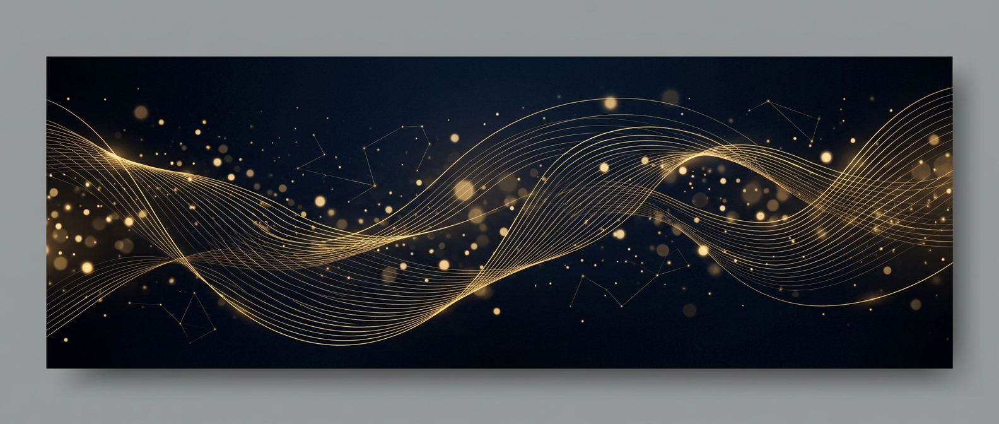

### 👋 Hello, I'm **Tawsif Khan**

#### AI Automation Engineer &nbsp;·&nbsp; Full-Stack Developer

> I build **agentic AI pipelines** that create content on autopilot —
> and craft **premium web experiences** that feel like a luxury brand.

📍 Bengaluru, India &nbsp;·&nbsp; 💼 [raaz.com](https://raaz.com) &nbsp;·&nbsp; ✉️ [tawsifk35@gmail.com](mailto:tawsifk35@gmail.com)

&nbsp;

 

<table>
  <tr>
    <td align="center" width="52%">
      
    </td>
    <td align="center" width="48%">
      
    </td>
  </tr>
  <tr>
    <td align="center" colspan="2" style="padding-top: 10px;">
      
    </td>
  </tr>
</table>

 

<table>
  <tr>
    <td align="center" width="33%">
      <h3>🤖 Agentic AI</h3>
      
Plan-then-execute workflows that automate content creation end-to-end — from research to publishing.

    </td>
    <td align="center" width="33%">
      <h3>⚡ Generative Pipelines</h3>
      
Image → video → publishing automation, and custom voice models trained with LoRA.

    </td>
    <td align="center" width="33%">
      <h3>🌐 Premium Web</h3>
      
Next.js, TypeScript & Tailwind — interfaces engineered to feel high-end.

    </td>
  </tr>
</table>

 

## 🚀 Featured Projects

<table>
  <tr>
    <td width="50%" style="vertical-align: top; padding: 8px;">
      <table>
        <tr>
          <td style="background: #101828; border: 1px solid #2a3550; border-radius: 10px; padding: 18px;">
            <h3 style="margin-top: 0;">🏔️ highland-estate</h3>
            
A <b>luxury coffee-estate resort landing page</b>. Cinematic hero, smooth-scroll sections, and a modern Next.js architecture built to feel like a five-star hospitality brand.

            
            
            
              
            <a href="https://github.com/tawsif-raza/highland-estate">⚡ <b>View Code</b></a>
          </td>
        </tr>
      </table>
    </td>
    <td width="50%" style="vertical-align: top; padding: 8px;">
      <table>
        <tr>
          <td style="background: #101828; border: 1px solid #2a3550; border-radius: 10px; padding: 18px;">
            <h3 style="margin-top: 0;">🎬 ai-video-studio</h3>
            
A <b>generative AI content studio</b>. Automated content production using a plan-then-execute agentic workflow — the agent plans, writes grounded content, and assembles publish-ready output.

            
            
            
              
            <a href="https://github.com/tawsif-raza/ai-video-studio">⚡ <b>View Code</b></a>
          </td>
        </tr>
      </table>
    </td>
  </tr>
  <tr>
    <td width="50%" style="vertical-align: top; padding: 8px;">
      <table>
        <tr>
          <td style="background: #101828; border: 1px solid #2a3550; border-radius: 10px; padding: 18px;">
            <h3 style="margin-top: 0;">📡 ai-auto-post</h3>
            
An <b>end-to-end AI publishing pipeline</b>: auto image generation → YouTube video publishing, fully automated with agentic workflows. Content that posts itself.

            
            
            
              
            <a href="https://github.com/tawsif-raza/ai-auto-post">⚡ <b>View Code</b></a>
          </td>
        </tr>
      </table>
    </td>
    <td width="50%" style="vertical-align: top; padding: 8px;">
      <table>
        <tr>
          <td style="background: #101828; border: 1px solid #2a3550; border-radius: 10px; padding: 18px;">
            <h3 style="margin-top: 0;">🎙️ ai-voice-employee</h3>
            
The <b>AI voice employee</b>. Custom voice models via LoRA fine-tuning — training speech that sounds natural, consistent, and on-brand.

            
            
            
              
            <a href="https://github.com/tawsif-raza/ai-voice-employee">⚡ <b>View Code</b></a>
          </td>
        </tr>
      </table>
    </td>
  </tr>
</table>

 

## 🧰 Tech Stack

<table>
  <tr>
    <td align="center">
      
      
      
      
      
      
    </td>
  </tr>
  <tr>
    <td align="center" style="padding-top: 8px;">
      
      
      
      
      
    </td>
  </tr>
</table>

 

## 📈 Contribution Graph

  

 

## 🤝 Let's Connect

[✉️ Email](mailto:tawsifk35@gmail.com) &nbsp;·&nbsp; [💼 raaz.com](https://raaz.com) &nbsp;·&nbsp; 📍 Bengaluru, India

 

🔭 Currently building a fully autonomous content engine — that plans, generates, and publishes on its own.  
© 2026 Tawsif Khan · Crafted with ❤️ and a dash of AI

