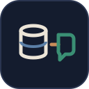

<div align="center">


# Hi, I'm Tawsif Khan

### AI Automation Engineer · Agentic Systems · Full-Stack Developer

<a href="https://github.com/tawsif-raza">
  
</a>

<p>
  
  <a href="mailto:tawsifk35@gmail.com"></a>
  <a href="https://raaz.com"></a>
  
</p>

</div>

---

## About Me

I build **AI systems that do real work** — not demos. My focus is agentic pipelines that plan, generate, and publish content end-to-end, retrieval-augmented assistants grounded in private data, and custom speech models. On the other side of the stack, I ship **premium web frontends** that feel like a luxury brand.

```python
class TawsifKhan:
    role      = "AI Automation Engineer"
    location  = "Bengaluru, India"
    focus     = ["Agentic workflows", "RAG", "Generative media pipelines", "LoRA fine-tuning"]
    web       = ["Next.js", "TypeScript", "Tailwind CSS", "Three.js"]
    building  = "A fully autonomous content engine — plans, generates, and publishes on its own."
    principle = "Plan → execute → verify. Automate the boring, engineer the hard."
```

<table>
  <tr>
    <td width="33%" valign="top">
      <h4>🤖 Agentic AI</h4>
      Plan-then-execute agents that research, write grounded content, and assemble publish-ready output with minimal human input.
    </td>
    <td width="33%" valign="top">
      <h4>🧠 RAG &amp; LLM Systems</h4>
      Retrieval pipelines over company knowledge — chunking, embeddings, vector search, and answers grounded in source documents.
    </td>
    <td width="33%" valign="top">
      <h4>🎙️ Generative Media</h4>
      Image → video → YouTube automation, plus custom voice models trained with LoRA for natural, on-brand speech.
    </td>
  </tr>
</table>

---

## Featured Projects

<table>
  <tr>
    <td width="50%" valign="top">
      <h3>&nbsp; <a href="https://github.com/tawsif-raza/ai-video-studio">ai-video-studio</a></h3>
      <p>Generative AI content studio. A <b>plan-then-execute agent</b> decomposes a brief into steps, writes grounded content, and assembles publish-ready output.</p>
      
      
      
    </td>
    <td width="50%" valign="top">
      <h3>&nbsp; <a href="https://github.com/tawsif-raza/RGA_CHATBOT">RAG Chatbot</a></h3>
      <p>A <b>retrieval-augmented chatbot</b> built on a specific company's data — answers are grounded in retrieved documents instead of the model's memory.</p>
      
      
      
    </td>
  </tr>
  <tr>
    <td width="50%" valign="top">
      <h3>&nbsp; <a href="https://github.com/tawsif-raza/ai-auto-post">ai-auto-post</a></h3>
      <p>End-to-end <b>AI publishing pipeline</b>: automated image generation → video assembly → YouTube upload, orchestrated by agentic workflows. Content that posts itself.</p>
      
      
      
    </td>
    <td width="50%" valign="top">
      <h3>&nbsp; <a href="https://github.com/tawsif-raza/ai-voice-employee">ai-voice-employee</a></h3>
      <p>An <b>AI voice employee</b>. Custom voice models trained via <b>LoRA fine-tuning</b> for speech that is natural, consistent, and on-brand.</p>
      
      
      
    </td>
  </tr>
  <tr>
    <td width="50%" valign="top">
      <h3>&nbsp; <a href="https://github.com/tawsif-raza/highland-estate">highland-estate</a></h3>
      <p>Luxury coffee-estate resort landing page. Cinematic hero, smooth-scroll sections, and a modern Next.js architecture built to feel five-star.</p>
      
      
      
    </td>
    <td width="50%" valign="top">
      <h3>&nbsp; <a href="https://github.com/tawsif-raza/jarvyhq-portfolio">jarvyhq-portfolio</a></h3>
      <p>Personal AI/ML engineering portfolio — a <b>dark, cinematic 3D site</b>. Plus a <a href="https://github.com/tawsif-raza/Portfolio-web">full-stack version</a> with frontend, backend &amp; test suite.</p>
      
      
      
    </td>
  </tr>
</table>

---

## Journey

| When | Milestone |
| :-- | :-- |
| **Jul 2026** | Started building in public — shipped **ai-auto-post** (image → YouTube pipeline) and **ai-video-studio** (plan-then-execute agent) |
| **Jul 2026** | Moved into speech AI with **ai-voice-employee** — custom voices via LoRA fine-tuning |
| **Aug 2026** | Expanded into premium web — **highland-estate** (Next.js + Tailwind) and a full-stack **Portfolio-web** with tests |
| **Sep 2026** | Built a cinematic 3D portfolio and a **RAG chatbot** grounded in company data |
| **Now** | Combining it all into a **fully autonomous content engine** that plans, generates, and publishes on its own |

---

## Tech Stack

<table>
  <tr>
    <td><b>Languages</b></td>
    <td>
      
      
      
    </td>
  </tr>
  <tr>
    <td><b>AI / LLM</b></td>
    <td>
      
      
      
      
      
      
    </td>
  </tr>
  <tr>
    <td><b>Web</b></td>
    <td>
      
      
      
      
    </td>
  </tr>
  <tr>
    <td><b>Tooling</b></td>
    <td>
      
      
      
      
    </td>
  </tr>
</table>

---

## GitHub Activity

<div align="center">
  
  
</div>

---

<div align="center">

## Let's Connect

Open to **AI automation**, **agentic workflow**, and **premium web** projects.

<a href="mailto:tawsifk35@gmail.com"></a>
<a href="https://raaz.com"></a>
<a href="https://github.com/tawsif-raza"></a>

<sub>© 2026 Tawsif Khan · Built with care and a dash of AI</sub>

</div>
